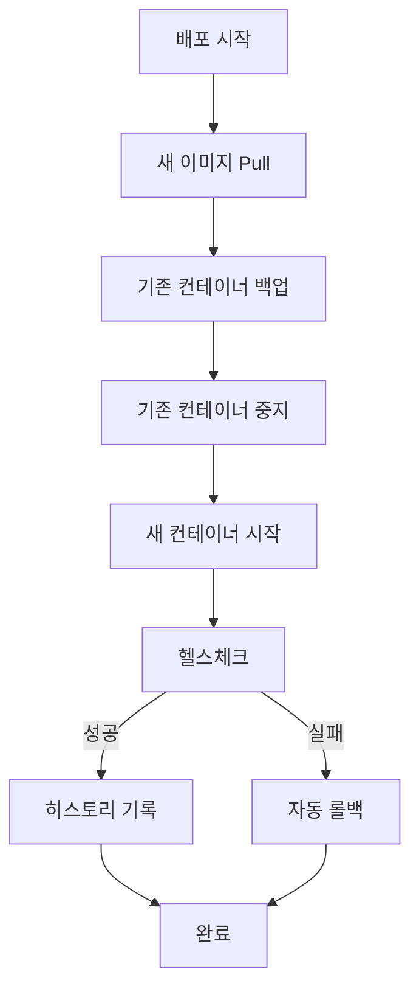
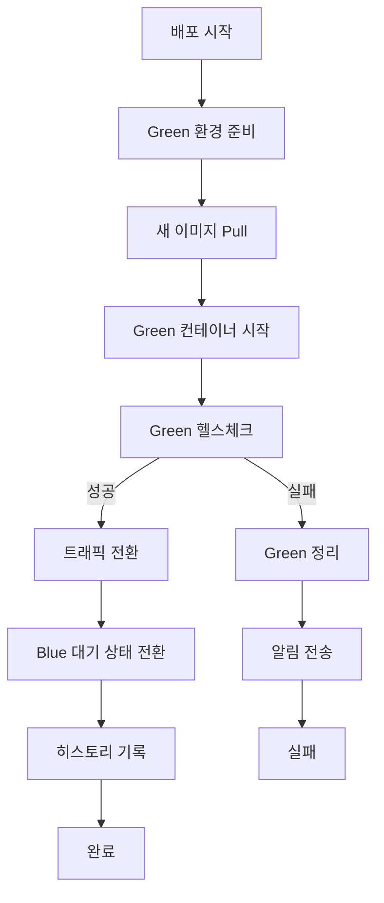
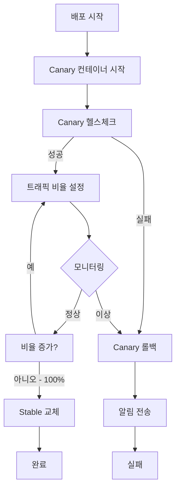

# CodeB Deploy System - 배포 전략 가이드

## 목차
1. [배포 전략 개요](#배포-전략-개요)
2. [Rolling 배포](#rolling-배포)
3. [Blue-Green 배포](#blue-green-배포)
4. [Canary 배포](#canary-배포)
5. [Preview 환경](#preview-환경)
6. [전략 선택 가이드](#전략-선택-가이드)
7. [환경별 포트 관리](#환경별-포트-관리)

---

## 배포 전략 개요

CodeB Deploy는 4가지 배포 방식을 지원합니다:

| 전략 | 다운타임 | 롤백 속도 | 리소스 요구 | 트래픽 제어 | 권장 환경 |
|------|----------|----------|------------|------------|----------|
| Rolling | 없음 | 보통 | 낮음 | 없음 | Staging |
| Blue-Green | 없음 | 즉시 | 높음 (2배) | 전체 전환 | Production |
| Canary | 없음 | 즉시 | 보통 | 점진적 | Production |
| Preview | 없음 | - | 낮음 | PR별 격리 | Development |

---

## Rolling 배포

### 개념

기존 컨테이너를 새 버전으로 순차적으로 교체하는 방식입니다.

```
┌─────────────────────────────────────────────────────────┐
│  Before:  [v1] [v1] [v1]                               │
│                                                         │
│  Step 1:  [v2] [v1] [v1]  ← 첫 번째 교체               │
│  Step 2:  [v2] [v2] [v1]  ← 두 번째 교체               │
│  Step 3:  [v2] [v2] [v2]  ← 완료                       │
└─────────────────────────────────────────────────────────┘
```

### 사용 방법

```bash
# Claude Code에서
"myapp staging에 배포해줘"
"myapp staging에 rolling 배포해줘"
```

### 배포 흐름



### 장단점

**장점:**
- ✅ 리소스 효율적 (추가 리소스 불필요)
- ✅ 간단한 구현
- ✅ 점진적 교체로 안정성 확보

**단점:**
- ❌ 롤백 시간이 오래 걸림
- ❌ 버전 혼재 기간 발생
- ❌ 트래픽 제어 불가

### 적합한 상황
- 개발/테스트 환경
- 빠른 반복 배포
- 리소스 제약이 있는 환경

---

## Blue-Green 배포

### 개념

새 버전(Green)을 완전히 준비한 후, 트래픽을 한 번에 전환하는 방식입니다.

```
┌─────────────────────────────────────────────────────────┐
│  Phase 1: 준비                                          │
│  ┌──────────┐     ┌──────────┐                         │
│  │  Blue    │ ←── │ Traffic  │                         │
│  │  (v1)    │     └──────────┘                         │
│  └──────────┘                                           │
│  ┌──────────┐                                           │
│  │  Green   │ (준비 중)                                 │
│  │  (v2)    │                                           │
│  └──────────┘                                           │
│                                                         │
│  Phase 2: 전환                                          │
│  ┌──────────┐                                           │
│  │  Blue    │ (대기)                                    │
│  │  (v1)    │                                           │
│  └──────────┘                                           │
│  ┌──────────┐     ┌──────────┐                         │
│  │  Green   │ ←── │ Traffic  │                         │
│  │  (v2)    │     └──────────┘                         │
│  └──────────┘                                           │
└─────────────────────────────────────────────────────────┘
```

### 사용 방법

```bash
# Claude Code에서
"myapp production에 blue-green 배포해줘"
```

### 배포 흐름



### Caddy 설정 예시

```caddyfile
# 전환 전 (Blue 활성)
myapp.codeb.dev {
    reverse_proxy localhost:4001  # Blue
}

# 전환 후 (Green 활성)
myapp.codeb.dev {
    reverse_proxy localhost:4002  # Green
}
```

### 장단점

**장점:**
- ✅ 즉시 롤백 가능 (설정 변경만으로)
- ✅ 무중단 배포 보장
- ✅ 새 버전 완전 검증 후 전환

**단점:**
- ❌ 리소스 2배 필요
- ❌ 데이터베이스 마이그레이션 복잡
- ❌ 상태 동기화 어려움

### 적합한 상황
- Production 환경
- 중요 서비스 배포
- 빠른 롤백이 필요한 경우

---

## Canary 배포

### 개념

새 버전으로 트래픽을 점진적으로 이동시키며 문제를 조기에 발견하는 방식입니다.

```
┌─────────────────────────────────────────────────────────┐
│  Phase 1: 10% 트래픽                                    │
│  [v1] [v1] [v1] [v1] [v1] [v1] [v1] [v1] [v1] [v2]     │
│   ↑    ↑    ↑    ↑    ↑    ↑    ↑    ↑    ↑    ↑      │
│  90% ────────────────────────────────────────  10%     │
│                                                         │
│  Phase 2: 50% 트래픽                                    │
│  [v1] [v1] [v1] [v1] [v1] [v2] [v2] [v2] [v2] [v2]     │
│   ↑    ↑    ↑    ↑    ↑    ↑    ↑    ↑    ↑    ↑      │
│  50% ────────────────────  50% ──────────────────      │
│                                                         │
│  Phase 3: 100% 트래픽                                   │
│  [v2] [v2] [v2] [v2] [v2] [v2] [v2] [v2] [v2] [v2]     │
│   ↑    ↑    ↑    ↑    ↑    ↑    ↑    ↑    ↑    ↑      │
│  100% ─────────────────────────────────────────────    │
└─────────────────────────────────────────────────────────┘
```

### 사용 방법

```bash
# Claude Code에서
"myapp production에 canary 배포 10%로 시작해줘"
"myapp canary 비율 50%로 올려줘"
"myapp canary 100%로 완료해줘"
```

### 배포 흐름



### Caddy 설정 예시 (가중치 라우팅)

```caddyfile
myapp.codeb.dev {
    reverse_proxy {
        to localhost:4001 localhost:4002
        lb_policy weighted_random
        # 가중치: 90% v1, 10% v2
    }
}
```

### 단계별 배포 예시

```yaml
# 권장 Canary 배포 단계
stages:
  - weight: 10
    duration: 10m
    metrics_check: true

  - weight: 25
    duration: 15m
    metrics_check: true

  - weight: 50
    duration: 30m
    metrics_check: true

  - weight: 100
    duration: stable
    metrics_check: false
```

### 장단점

**장점:**
- ✅ 리스크 최소화 (소수 사용자만 영향)
- ✅ 실제 트래픽으로 검증
- ✅ 빠른 롤백 가능
- ✅ A/B 테스트 가능

**단점:**
- ❌ 복잡한 설정
- ❌ 메트릭 모니터링 필수
- ❌ 버전 간 호환성 유지 필요

### 적합한 상황
- 대규모 Production 환경
- 신규 기능 점진적 출시
- A/B 테스트
- 리스크 민감한 배포

---

## Preview 환경

### 개념

PR(Pull Request)별로 독립된 환경을 생성하여 변경사항을 미리 확인할 수 있습니다.

```
┌─────────────────────────────────────────────────────────┐
│  Main Branch                                            │
│  └── Production                                         │
│                                                         │
│  PR #123                                                │
│  └── https://pr-123.myapp.preview.codeb.dev            │
│                                                         │
│  PR #124                                                │
│  └── https://pr-124.myapp.preview.codeb.dev            │
│                                                         │
│  PR #125                                                │
│  └── https://pr-125.myapp.preview.codeb.dev            │
└─────────────────────────────────────────────────────────┘
```

### 사용 방법

```bash
# Claude Code에서
"myapp PR-123 preview 환경 만들어줘"
"myapp preview 환경 목록 보여줘"
"myapp PR-123 preview 삭제해줘"
```

### GitHub Actions 통합

```yaml
# .github/workflows/preview.yml
name: Preview Deployment

on:
  pull_request:
    types: [opened, synchronize, reopened, closed]

jobs:
  preview:
    runs-on: self-hosted
    steps:
      - uses: actions/checkout@v4

      - name: Deploy Preview
        if: github.event.action != 'closed'
        run: |
          # Preview 배포 로직

      - name: Cleanup Preview
        if: github.event.action == 'closed'
        run: |
          # Preview 정리 로직

      - name: Comment PR
        uses: actions/github-script@v7
        with:
          script: |
            github.rest.issues.createComment({
              issue_number: context.issue.number,
              owner: context.repo.owner,
              repo: context.repo.repo,
              body: '🚀 Preview deployed: https://pr-${{ github.event.number }}.myapp.preview.codeb.dev'
            })
```

### 자동 정리

Preview 환경은 기본 72시간 후 자동 삭제됩니다:

```typescript
{
  ttlHours: 72,  // 기본값
  // PR 닫힘 시 즉시 삭제
}
```

---

## 전략 선택 가이드

### 의사결정 플로우차트

```
                    ┌─────────────────┐
                    │  배포 환경?     │
                    └────────┬────────┘
                             │
            ┌────────────────┼────────────────┐
            ▼                ▼                ▼
    ┌───────────┐    ┌───────────┐    ┌───────────┐
    │Development│    │  Staging  │    │Production │
    └─────┬─────┘    └─────┬─────┘    └─────┬─────┘
          │                │                │
          ▼                ▼                ▼
    ┌───────────┐    ┌───────────┐    ┌───────────────┐
    │  Preview  │    │  Rolling  │    │ 리스크 레벨?  │
    └───────────┘    └───────────┘    └───────┬───────┘
                                              │
                              ┌───────────────┼───────────────┐
                              ▼               ▼               ▼
                        ┌──────────┐   ┌──────────┐   ┌──────────┐
                        │   낮음   │   │   보통   │   │   높음   │
                        └────┬─────┘   └────┬─────┘   └────┬─────┘
                             │              │              │
                             ▼              ▼              ▼
                        ┌──────────┐   ┌──────────┐   ┌──────────┐
                        │ Rolling  │   │Blue-Green│   │  Canary  │
                        └──────────┘   └──────────┘   └──────────┘
```

### 환경별 권장 전략

| 환경 | 기본 전략 | 대안 전략 | 이유 |
|------|----------|----------|------|
| Development | Preview | - | PR별 격리 테스트 |
| Staging | Rolling | - | 빠른 반복, 리소스 효율 |
| Production (낮은 리스크) | Rolling | Blue-Green | 간단한 변경 |
| Production (중간 리스크) | Blue-Green | Canary | 빠른 롤백 필요 |
| Production (높은 리스크) | Canary | - | 점진적 검증 필수 |

### 변경 유형별 권장 전략

| 변경 유형 | 권장 전략 | 이유 |
|----------|----------|------|
| 버그 수정 | Rolling | 빠른 배포 |
| 마이너 기능 | Blue-Green | 안전한 롤백 |
| 메이저 기능 | Canary | 점진적 출시 |
| 인프라 변경 | Blue-Green | 완전한 격리 |
| DB 마이그레이션 | Canary + Feature Flag | 호환성 유지 |

---

## 환경별 포트 관리

### 포트 범위

| 환경 | 앱 포트 | DB 포트 | Redis 포트 |
|------|---------|---------|------------|
| Staging | 3000-3499 | 5432-5449 | 6379-6399 |
| Production | 4000-4499 | 5450-5469 | 6400-6419 |
| Preview | 5000-5999 | - | - |

### 포트 할당 예시

```json
{
  "staging": {
    "myapp": {
      "app": 3001,
      "db": 5433,
      "redis": 6380
    },
    "another-app": {
      "app": 3002,
      "db": 5434,
      "redis": 6381
    }
  },
  "production": {
    "myapp-blue": {
      "app": 4001
    },
    "myapp-green": {
      "app": 4002
    }
  },
  "preview": {
    "pr-123": {
      "app": 5001
    },
    "pr-124": {
      "app": 5002
    }
  }
}
```

### 포트 충돌 방지

PortRegistry가 자동으로 사용 가능한 포트를 할당합니다:

```bash
# 포트 현황 확인
"포트 할당 현황 보여줘"
```

---

## 다음 단계

- [모니터링 및 알림 가이드](04-MONITORING-ALERTING.md) - 배포 후 모니터링
- [보안 스캔 가이드](05-SECURITY-SCANNING.md) - 배포 전 보안 검증
- [문제 해결 가이드](06-TROUBLESHOOTING.md) - 배포 문제 해결
