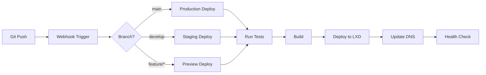

# 🔄 LXD CLI - Git 기반 CI/CD 파이프라인 상세 설계

## 📋 개요

Git을 중심으로 한 자동화된 CI/CD 파이프라인 구현 방안입니다.

---

## 🎯 Git 워크플로우

### 1. Git 저장소 연동 프로세스

```bash
# 프로젝트 생성 시 Git 저장소 자동 연동
lxdctl project create myapp --git https://github.com/user/myapp

# 이 명령어가 수행하는 작업:
# 1. LXD 컨테이너 생성
# 2. Git 저장소 클론
# 3. Webhook 자동 등록
# 4. CI/CD 파이프라인 설정
```

### 2. Git 이벤트 기반 자동화



---

## 🚀 CI/CD 트리거 방식

### 1. **Push 기반 (권장)**
```yaml
# GitHub/GitLab → Webhook → LXD Server
triggers:
  - on: push
    branches: [main, develop]
    action: deploy
  - on: pull_request
    action: preview
  - on: tag
    pattern: v*
    action: release
```

### 2. **Pull 기반**
```yaml
# LXD Server가 주기적으로 Git 체크
schedule:
  - cron: "*/5 * * * *"  # 5분마다
    action: check_and_deploy
```

---

## 📦 Git 통합 방식

### Option 1: 직접 Git 연동 (Built-in)
```javascript
// LXD CLI가 직접 Git 작업 수행
class GitManager {
  async clone(repo, branch) {
    await exec(`git clone -b ${branch} ${repo} /containers/${project}/app`);
  }
  
  async pull() {
    await exec(`git pull origin ${branch}`);
  }
  
  async getCurrentCommit() {
    return await exec(`git rev-parse HEAD`);
  }
}
```

### Option 2: GitHub Actions 연동
```yaml
# .github/workflows/deploy.yml
name: Deploy to LXD
on:
  push:
    branches: [main]

jobs:
  deploy:
    runs-on: ubuntu-latest
    steps:
      - uses: actions/checkout@v3
      
      - name: Deploy to LXD
        env:
          LXD_SERVER: ${{ secrets.LXD_SERVER }}
          LXD_TOKEN: ${{ secrets.LXD_TOKEN }}
        run: |
          # GitHub Actions Runner가 LXD CLI 호출
          curl -X POST $LXD_SERVER/api/deploy \
            -H "Authorization: Bearer $LXD_TOKEN" \
            -d '{
              "project": "${{ github.repository }}",
              "commit": "${{ github.sha }}",
              "branch": "${{ github.ref }}"
            }'
```

### Option 3: GitLab CI 연동
```yaml
# .gitlab-ci.yml
deploy:
  stage: deploy
  script:
    - apt-get update && apt-get install -y lxdctl
    - lxdctl deploy $CI_PROJECT_NAME --commit $CI_COMMIT_SHA
  only:
    - main
```

### Option 4: Jenkins 연동
```groovy
// Jenkinsfile
pipeline {
    agent any
    
    stages {
        stage('Checkout') {
            steps {
                git branch: 'main', url: 'https://github.com/user/repo'
            }
        }
        
        stage('Deploy to LXD') {
            steps {
                sh 'lxdctl deploy ${JOB_NAME} --commit ${GIT_COMMIT}'
            }
        }
    }
}
```

---

## 🔧 구현 세부사항

### 1. Webhook 수신 서버
```javascript
// webhook-server.js
const express = require('express');
const crypto = require('crypto');
const app = express();

// GitHub Webhook 처리
app.post('/webhook/github', (req, res) => {
  // 서명 검증
  const signature = req.headers['x-hub-signature-256'];
  const payload = JSON.stringify(req.body);
  const expectedSignature = 'sha256=' + crypto
    .createHmac('sha256', process.env.GITHUB_WEBHOOK_SECRET)
    .update(payload)
    .digest('hex');
  
  if (signature !== expectedSignature) {
    return res.status(401).send('Invalid signature');
  }
  
  // 이벤트 처리
  const { ref, repository, commits, pusher } = req.body;
  
  if (ref === 'refs/heads/main') {
    // Production 배포
    deployProject({
      project: repository.name,
      branch: 'main',
      commits: commits,
      author: pusher.name
    });
  }
  
  res.status(200).send('OK');
});

// GitLab Webhook 처리
app.post('/webhook/gitlab', (req, res) => {
  const token = req.headers['x-gitlab-token'];
  
  if (token !== process.env.GITLAB_WEBHOOK_TOKEN) {
    return res.status(401).send('Invalid token');
  }
  
  const { ref, project, commits, user_name } = req.body;
  
  // 배포 로직...
});
```

### 2. 배포 프로세스
```javascript
async function deployProject({ project, branch, commits }) {
  try {
    // 1. 현재 버전 백업
    await backupCurrentVersion(project);
    
    // 2. Git Pull
    await gitPull(project, branch);
    
    // 3. 의존성 설치
    await installDependencies(project);
    
    // 4. 테스트 실행
    const testResult = await runTests(project);
    if (!testResult.success) {
      throw new Error('Tests failed');
    }
    
    // 5. 빌드
    await buildProject(project);
    
    // 6. 새 버전 배포
    await deployNewVersion(project);
    
    // 7. 헬스체크
    const health = await healthCheck(project);
    if (!health.ok) {
      await rollback(project);
      throw new Error('Health check failed');
    }
    
    // 8. 알림
    await notify({
      project,
      status: 'success',
      commits,
      deployedAt: new Date()
    });
    
  } catch (error) {
    // 롤백
    await rollback(project);
    await notify({
      project,
      status: 'failed',
      error: error.message
    });
  }
}
```

### 3. 파이프라인 설정 파일
```yaml
# .lxdctl.yml - 프로젝트 루트에 위치
version: '1.0'

project:
  name: myapp
  runtime: node:18

build:
  commands:
    - npm install
    - npm run build
  artifacts:
    - dist/
    - build/

test:
  commands:
    - npm run test
    - npm run lint
  coverage:
    threshold: 80

deploy:
  branches:
    main:
      environment: production
      domain: myapp.com
      ssl: true
    develop:
      environment: staging
      domain: staging.myapp.com
    feature/*:
      environment: preview
      domain: "{{branch}}.preview.myapp.com"
      
  pre_deploy:
    - npm run migrate
    
  post_deploy:
    - npm run seed
    - curl https://myapp.com/health

notifications:
  slack:
    webhook: https://hooks.slack.com/xxx
    channels:
      - "#deployments"
  email:
    - admin@myapp.com
```

---

## 🔄 배포 전략

### 1. Standard Deploy (기본)
```bash
# Git에서 최신 코드 pull → 빌드 → 배포
lxdctl deploy myapp
```

### 2. Blue-Green Deploy
```bash
# 새 컨테이너 생성 → 배포 → 트래픽 전환 → 구 컨테이너 제거
lxdctl deploy myapp --strategy blue-green
```

```javascript
async function blueGreenDeploy(project) {
  // 1. Green 환경 생성
  const greenContainer = await createContainer(`${project}-green`);
  
  // 2. Green에 새 버전 배포
  await deployToContainer(greenContainer, 'latest');
  
  // 3. Green 헬스체크
  await healthCheck(greenContainer);
  
  // 4. 트래픽 전환 (Blue → Green)
  await switchTraffic(project, greenContainer);
  
  // 5. Blue 환경 제거
  await removeContainer(`${project}-blue`);
  
  // 6. Green을 Blue로 rename
  await renameContainer(greenContainer, `${project}-blue`);
}
```

### 3. Canary Deploy
```bash
# 10% 트래픽만 새 버전으로
lxdctl deploy myapp --strategy canary --percentage 10
```

### 4. Rolling Deploy
```bash
# 인스턴스를 순차적으로 업데이트
lxdctl deploy myapp --strategy rolling --batch-size 2
```

---

## 📊 CI/CD 메트릭

### 추적할 지표
```yaml
metrics:
  deployment_frequency: "하루 배포 횟수"
  lead_time: "커밋에서 배포까지 시간"
  mttr: "장애 복구 시간"
  change_failure_rate: "배포 실패율"
  
  build_time: "빌드 소요 시간"
  test_coverage: "테스트 커버리지"
  deployment_time: "배포 소요 시간"
  rollback_rate: "롤백 비율"
```

---

## 🔐 보안 고려사항

### Git 인증
```yaml
authentication:
  ssh_keys: "배포 전용 SSH 키"
  deploy_tokens: "읽기 전용 토큰"
  personal_tokens: "개인 액세스 토큰"
  
webhook_security:
  secret_validation: "Webhook 시크릿 검증"
  ip_whitelist: "GitHub/GitLab IP만 허용"
  rate_limiting: "분당 최대 10회"
```

### 시크릿 관리
```bash
# 환경 변수는 Git에 저장하지 않음
lxdctl secrets set myapp DB_PASSWORD=xxx
lxdctl secrets set myapp API_KEY=yyy

# .env.example만 커밋
DB_PASSWORD=
API_KEY=
```

---

## 🎯 구현 우선순위

### Phase 1: 기본 Git 연동
1. Git clone/pull 기능
2. Webhook 수신 서버
3. 기본 배포 프로세스

### Phase 2: CI/CD 파이프라인
1. 테스트 자동화
2. 빌드 프로세스
3. 배포 전략 (Blue-Green)

### Phase 3: 고급 기능
1. Canary 배포
2. 자동 롤백
3. 멀티 브랜치 배포

---

## 💡 실제 사용 시나리오

### 개발자 워크플로우
```bash
# 1. 프로젝트 초기 설정
lxdctl project create myapp --git https://github.com/user/myapp

# 2. 개발 (로컬)
git checkout -b feature/new-feature
# ... 코드 작성 ...
git commit -m "Add new feature"
git push origin feature/new-feature

# 3. PR 생성 → 자동으로 Preview 환경 생성
# URL: feature-new-feature.preview.myapp.com

# 4. PR 머지 → 자동으로 Staging 배포
# URL: staging.myapp.com

# 5. Tag 생성 → Production 배포
git tag v1.0.0
git push origin v1.0.0
# URL: myapp.com
```

---

**작성일**: 2025-08-18  
**상태**: 🔄 상세 설계 완료