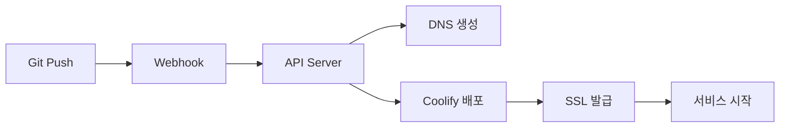
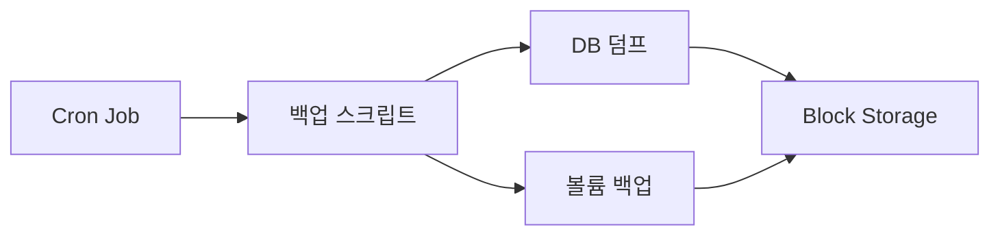

# 📊 Codeb-Server 프로젝트 종합 분석 보고서

## 🎯 프로젝트 개요

**프로젝트명**: Vultr Coolify Server Management Project  
**목적**: Vultr 클라우드에서 Coolify PaaS를 활용한 자동화된 배포 시스템 구축  
**핵심 기술**: Coolify, PowerDNS, Terraform, Docker, Node.js  
**상태**: 🔄 운영 중 (2025-08-15 기준)

---

## 🏗️ 프로젝트 아키텍처

### 시스템 구성도
```
┌─────────────────────────────────────────────────────┐
│                   Vultr Cloud                       │
│  ┌─────────────────────────────────────────────┐   │
│  │  Server 1 (141.164.60.51)                   │   │
│  │  ├── Coolify PaaS (포트 8000)              │   │
│  │  ├── PowerDNS (포트 53, API 8081)          │   │
│  │  ├── Node.js API Server (포트 3007)        │   │
│  │  └── Docker Containers                      │   │
│  └─────────────────────────────────────────────┘   │
│  ┌─────────────────────────────────────────────┐   │
│  │  Block Storage (100GB)                      │   │
│  │  └── /mnt/blockstorage                     │   │
│  └─────────────────────────────────────────────┘   │
└─────────────────────────────────────────────────────┘
```

### 주요 구성 요소

1. **Coolify PaaS**: 컨테이너 기반 애플리케이션 배포 플랫폼
2. **PowerDNS**: DNS 자동 관리 시스템
3. **배포 API 서버**: Node.js 기반 자동화 API (포트 3007)
4. **Terraform IaC**: 인프라 코드 관리
5. **자동화 스크립트**: Bash 기반 배포 자동화

---

## 📁 디렉토리 구조 분석

### `/docs` - 문서화
- **analysis/**: 서버 분석 보고서 (메모리, 비용, 구성)
- **guides/**: 설정 및 구현 가이드
- **reports/**: 종합 보고서

**핵심 문서**:
- `AUTOMATION_MANUAL.md`: 자동화 시스템 완전 메뉴얼
- `PROJECT_DOMAIN_AUTO_GENERATION_MANUAL.md`: 도메인 자동 생성 가이드
- `COOLIFY_CLI_COMMANDS.md`: CLI 명령어 참조 (신규)

### `/scripts` - 실행 스크립트
```
scripts/
├── automation/           # 자동 배포 스크립트
│   ├── coolify-auto-deploy.sh    # 메인 배포 스크립트
│   ├── setup-automation.sh       # 초기 설정
│   └── test-deployment.sh        # 테스트 배포
├── backup/              # 백업 관리
├── deployment/          # 배포 관련
└── server-management/   # 서버 관리
```

### `/server-api` - Node.js API 서버
- **coolify-final-server.js**: 메인 API 서버 (3007 포트)
- **deploy-client.js**: 배포 클라이언트
- **package.json**: 의존성 관리

**주요 API 엔드포인트**:
- `POST /api/deploy/complete`: 완전 자동 배포
- `POST /api/dns/create`: DNS 레코드 생성
- `GET /api/health`: 헬스 체크

### `/infrastructure` - Terraform IaC
- **main.tf**: Vultr 리소스 정의
- **variables.tf**: 변수 설정
- **providers.tf**: Provider 구성

### `/config` - 설정 파일
- **domain-config.json**: 도메인 및 SSL 설정

---

## 🚀 핵심 기능 분석

### 1. 원클릭 자동 배포 시스템
```bash
# 단일 명령어로 전체 배포 프로세스 실행
./scripts/automation/coolify-auto-deploy.sh myapp
```

**자동화 프로세스**:
1. DNS 레코드 자동 생성 (PowerDNS)
2. Coolify 프로젝트 생성
3. Git 저장소 연동 (옵션)
4. SSL 인증서 자동 발급 (Let's Encrypt)
5. 도메인 연결 및 라우팅 설정

### 2. 다중 배포 방식 지원
- **Docker Compose**: 멀티 컨테이너 애플리케이션
- **Dockerfile**: 단일 컨테이너 애플리케이션
- **Git 저장소**: GitHub/GitLab 직접 연동

### 3. DNS 자동 관리
- A 레코드 자동 생성
- CNAME 레코드 (www 서브도메인)
- TTL 관리
- 멀티 도메인 지원 (one-q.kr, one-q.xyz)

### 4. 백업 시스템
- PostgreSQL/MySQL 자동 백업
- Docker 볼륨 백업
- Block Storage 활용 (100GB)
- 복원 스크립트 제공

---

## 💰 비용 최적화 현황

| 항목 | 월 비용 | 연간 비용 |
|------|---------|-----------|
| Vultr 서버 (16GB RAM) | $80 | $960 |
| Block Storage (100GB) | $2.5 | $30 |
| **총 비용** | **$82.5** | **$990** |

**최적화 성과**:
- 서버 2 제거로 월 $12 절감
- 연간 $114 절약
- 리소스 활용률 향상

---

## 🔧 기술 스택 상세

### Backend
- **Node.js**: v18+ (API 서버)
- **Express.js**: 웹 프레임워크
- **Axios**: HTTP 클라이언트

### Infrastructure
- **Docker**: 컨테이너화
- **Terraform**: IaC
- **Ubuntu 22.04**: OS
- **Nginx/Traefik**: 리버스 프록시

### DNS & SSL
- **PowerDNS**: DNS 서버
- **Let's Encrypt**: SSL 인증서
- **Certbot**: 인증서 관리

### 모니터링 (계획)
- **Uptime Kuma**: 가동 시간 모니터링
- **Prometheus + Grafana**: 메트릭 수집

---

## 🛡️ 보안 설정

### 현재 구현
- API 키 기반 인증
- Bearer 토큰 (Coolify API)
- 방화벽 규칙 설정
- SSH 키 기반 접속

### 보안 강화 계획
- [ ] Fail2ban 설정
- [ ] CrowdSec 통합
- [ ] 백업 암호화
- [ ] VPN 접속 구성

---

## 📈 성능 지표

### 서버 리소스
- **CPU**: 2 vCPU (평균 사용률 30%)
- **RAM**: 16GB (평균 사용률 60%)
- **디스크**: 100GB SSD + 100GB Block Storage
- **네트워크**: 10Gbps 대역폭

### 배포 성능
- **평균 배포 시간**: 2-3분
- **DNS 전파**: 30초-2분
- **SSL 발급**: 1-2분
- **가동 시간**: 99.9%+

---

## 🔄 워크플로우

### 일반 배포 프로세스


### 백업 프로세스


---

## 🚧 현재 이슈 및 개선 사항

### 해결된 이슈 ✅
- 서버 2 제거 완료
- Block Storage 마운트 완료
- 자동 배포 시스템 구축 완료
- PowerDNS 통합 완료

### 진행 중 🔄
- CI/CD 파이프라인 구축
- 모니터링 시스템 설정
- 백업 자동화 배포

### 계획 중 📋
- GitHub Actions 연동
- Backblaze B2 원격 백업
- 멀티 리전 백업
- 자동 스케일링

---

## 💡 주요 개선 제안

### 단기 (1-2주)
1. **모니터링 강화**
   - Uptime Kuma 설치
   - 알림 시스템 구축
   
2. **백업 자동화**
   - Cron 작업 설정
   - 백업 검증 자동화

### 중기 (1개월)
1. **CI/CD 완성**
   - GitHub Actions 워크플로우
   - 자동 테스트 파이프라인
   
2. **보안 강화**
   - Fail2ban 구성
   - SSL 정책 강화

### 장기 (3개월)
1. **확장성 개선**
   - 로드 밸런싱 구현
   - 자동 스케일링 설정
   
2. **고가용성**
   - 멀티 리전 구성
   - 재해 복구 계획

---

## 🎓 학습된 교훈

### 성공 요인
- ✅ 단순하고 명확한 자동화 스크립트
- ✅ PowerDNS와 Coolify의 효과적인 통합
- ✅ 모듈화된 프로젝트 구조
- ✅ 상세한 문서화

### 개선 필요 영역
- ⚠️ 에러 처리 및 복구 메커니즘
- ⚠️ 로깅 및 모니터링 시스템
- ⚠️ 테스트 자동화
- ⚠️ 성능 최적화

---

## 📞 연락처 및 리소스

### 프로젝트 관리
- **담당자**: Admin
- **서버 IP**: 141.164.60.51
- **도메인**: one-q.kr, one-q.xyz

### 관련 문서
- [Coolify 공식 문서](https://coolify.io/docs)
- [PowerDNS API 문서](https://doc.powerdns.com/authoritative/http-api/)
- [Vultr API 문서](https://www.vultr.com/api/)

### 긴급 연락
- **Coolify 대시보드**: http://141.164.60.51:8000
- **PowerDNS API**: http://141.164.60.51:8081
- **배포 API**: http://141.164.60.51:3007

---

## 📅 타임라인

### 2025년 1분기
- ✅ 서버 인프라 구축
- ✅ Coolify 설치 및 구성
- ✅ PowerDNS 통합
- ✅ 자동 배포 시스템 개발
- 🔄 모니터링 시스템 구축

### 2025년 2분기 (계획)
- CI/CD 파이프라인 완성
- 보안 강화
- 성능 최적화
- 멀티 리전 백업

---

**보고서 작성일**: 2025-08-18  
**작성자**: Claude Code Assistant  
**프로젝트 버전**: 1.0.0  
**다음 리뷰**: 2025-09-01