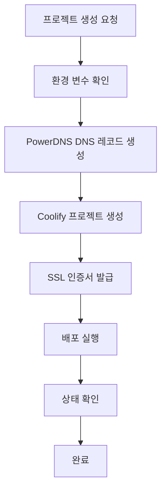

# 🚀 Coolify + PowerDNS 자동화 가이드

Coolify와 PowerDNS를 연동하여 프로젝트 생성 시 도메인 자동 생성 및 배포 자동화 가이드

## 📊 현재 환경

### ✅ 설치된 서비스
- **Coolify**: 8000번 포트 (PaaS 플랫폼)
- **PowerDNS**: 53번 포트 (DNS 서버), 8081번 포트 (API)
- **서버 IP**: 141.164.60.51

### 🔧 서비스 상태
```bash
# Coolify 컨테이너들
- coolify: 메인 플랫폼
- coolify-sentinel: 모니터링
- coolify-realtime: 실시간 업데이트
- coolify-redis: 캐시
- coolify-db: PostgreSQL

# PowerDNS
- pdns.service: 활성화 상태
- API 엔드포인트: http://141.164.60.51:8081/api/v1
```

## 🎯 자동화 시나리오

### 시나리오 1: 기본 웹 애플리케이션 배포
```bash
# 프로젝트 생성 + 도메인 자동 생성
./scripts/automation/coolify-auto-deploy.sh myapp

# 결과:
# - 도메인: myapp.your-domain.com
# - DNS A 레코드 자동 생성
# - Coolify 프로젝트 생성
# - 자동 배포
```

### 시나리오 2: Git 저장소에서 자동 배포
```bash
# Git 저장소에서 프로젝트 배포
./scripts/automation/coolify-auto-deploy.sh \
  -t git \
  -r https://github.com/user/repo \
  -d api.example.com \
  --ssl \
  myapi

# 결과:
# - Git 저장소 클론
# - 커스텀 도메인 설정
# - SSL 인증서 자동 발급
# - 자동 배포
```

### 시나리오 3: Docker Compose 프로젝트
```bash
# Docker Compose 기반 프로젝트
./scripts/automation/coolify-auto-deploy.sh \
  -t docker-compose \
  -p 8080 \
  --ssl \
  webapp

# 결과:
# - Docker Compose 템플릿 생성
# - 포트 8080 사용
# - SSL 포함 배포
```

## ⚙️ 설정 방법

### 1. PowerDNS API 키 설정

#### API 키 생성
```bash
# 서버에 접속
ssh root@141.164.60.51

# PowerDNS 설정 확인
cat /etc/powerdns/pdns.conf | grep api

# API 키 설정 (없는 경우)
echo "api-key=your-secret-api-key" >> /etc/powerdns/pdns.conf
echo "webserver=yes" >> /etc/powerdns/pdns.conf
echo "webserver-port=8081" >> /etc/powerdns/pdns.conf

# 서비스 재시작
systemctl restart pdns
```

#### 환경 변수 설정
```bash
# 로컬에서 API 키 설정
export PDNS_API_KEY="your-secret-api-key"

# ~/.zshrc에 추가하여 영구 설정
echo 'export PDNS_API_KEY="your-secret-api-key"' >> ~/.zshrc
source ~/.zshrc
```

### 2. Coolify API 토큰 설정

#### Coolify에서 API 토큰 생성
1. Coolify 웹 인터페이스 접속: http://141.164.60.51:8000
2. Settings → API Tokens
3. 새 토큰 생성
4. 토큰 복사

#### 환경 변수 설정
```bash
export COOLIFY_API_TOKEN="your-coolify-token"
echo 'export COOLIFY_API_TOKEN="your-coolify-token"' >> ~/.zshrc
```

### 3. 기본 도메인 설정

#### 스크립트 설정 수정
```bash
# 스크립트에서 BASE_DOMAIN 수정
vim /Users/admin/new_project/codeb-server/scripts/automation/coolify-auto-deploy.sh

# 다음 줄 수정:
BASE_DOMAIN="your-actual-domain.com"
```

## 🔧 PowerDNS 고급 설정

### 존 (Zone) 관리

#### 메인 도메인 존 생성
```bash
# PowerDNS API를 통한 존 생성
curl -X POST http://141.164.60.51:8081/api/v1/servers/localhost/zones \
  -H "X-API-Key: your-api-key" \
  -H "Content-Type: application/json" \
  -d '{
    "name": "your-domain.com",
    "kind": "Native",
    "masters": [],
    "nameservers": ["ns1.your-domain.com", "ns2.your-domain.com"]
  }'
```

#### DNS 레코드 관리
```bash
# A 레코드 추가
curl -X PATCH http://141.164.60.51:8081/api/v1/servers/localhost/zones/your-domain.com \
  -H "X-API-Key: your-api-key" \
  -H "Content-Type: application/json" \
  -d '{
    "rrsets": [
      {
        "name": "app.your-domain.com",
        "type": "A",
        "records": [
          {
            "content": "141.164.60.51",
            "disabled": false
          }
        ]
      }
    ]
  }'
```

### 네임서버 설정

#### 도메인 등록업체에서 네임서버 변경
```
ns1.your-domain.com → 141.164.60.51
ns2.your-domain.com → 141.164.60.51
```

## 🚀 Coolify 고급 설정

### 프로젝트 템플릿

#### Docker Compose 템플릿
```yaml
version: '3.8'
services:
  app:
    image: ${IMAGE_NAME:-nginx:alpine}
    ports:
      - "${PORT:-3000}:${INTERNAL_PORT:-80}"
    environment:
      - NODE_ENV=${NODE_ENV:-production}
      - DATABASE_URL=${DATABASE_URL}
    labels:
      - "traefik.enable=true"
      - "traefik.http.routers.${PROJECT_NAME}.rule=Host(`${DOMAIN}`)"
      - "traefik.http.routers.${PROJECT_NAME}.tls=true"
      - "traefik.http.routers.${PROJECT_NAME}.tls.certresolver=letsencrypt"
  
  db:
    image: postgres:15-alpine
    environment:
      - POSTGRES_DB=${DB_NAME}
      - POSTGRES_USER=${DB_USER}
      - POSTGRES_PASSWORD=${DB_PASSWORD}
    volumes:
      - db_data:/var/lib/postgresql/data

volumes:
  db_data:
```

#### Git 프로젝트 설정
```json
{
  "name": "PROJECT_NAME",
  "repository": "REPO_URL",
  "branch": "main",
  "build_command": "npm run build",
  "start_command": "npm start",
  "environment": {
    "NODE_ENV": "production",
    "PORT": "3000"
  },
  "domains": ["DOMAIN"],
  "ssl": true
}
```

## 🔄 자동화 워크플로우

### 전체 프로세스


### 배포 검증 체계
```bash
# 1. DNS 전파 확인
dig +short app.your-domain.com

# 2. HTTP 응답 확인
curl -I http://app.your-domain.com

# 3. SSL 인증서 확인
curl -I https://app.your-domain.com

# 4. Coolify 상태 확인
curl http://141.164.60.51:8000/api/projects
```

## 🛠️ 관리 도구

### DNS 관리 스크립트
```bash
#!/bin/bash
# dns-manager.sh

case "$1" in
  "list")
    # DNS 레코드 목록
    curl -s -H "X-API-Key: $PDNS_API_KEY" \
      http://141.164.60.51:8081/api/v1/servers/localhost/zones/your-domain.com
    ;;
  "add")
    # DNS 레코드 추가
    # ./dns-manager.sh add subdomain A 141.164.60.51
    ;;
  "delete")
    # DNS 레코드 삭제
    ;;
esac
```

### Coolify 프로젝트 관리
```bash
#!/bin/bash
# coolify-manager.sh

case "$1" in
  "list")
    # 프로젝트 목록
    curl -H "Authorization: Bearer $COOLIFY_API_TOKEN" \
      http://141.164.60.51:8000/api/projects
    ;;
  "deploy")
    # 프로젝트 배포
    ;;
  "logs")
    # 배포 로그 확인
    ;;
esac
```

## 📈 모니터링 및 알림

### 상태 모니터링
```bash
#!/bin/bash
# monitor-services.sh

# PowerDNS 상태 확인
systemctl is-active pdns

# Coolify 컨테이너 상태 확인
docker ps --filter "name=coolify"

# DNS 해상도 테스트
dig @141.164.60.51 your-domain.com

# 웹 서비스 상태 확인
curl -s -o /dev/null -w "%{http_code}" http://141.164.60.51:8000
```

### 자동 알림 설정
```bash
# Slack 웹훅을 통한 배포 알림
send_slack_notification() {
    local message="$1"
    curl -X POST -H 'Content-type: application/json' \
        --data "{\"text\":\"$message\"}" \
        $SLACK_WEBHOOK_URL
}

# 배포 완료 알림
send_slack_notification "✅ 프로젝트 '$PROJECT_NAME' 배포 완료: https://$DOMAIN"
```

## 🚨 문제 해결

### 일반적인 문제

#### 1. DNS 레코드 생성 실패
**증상**: "API call failed" 오류
**해결**:
```bash
# PowerDNS API 상태 확인
curl http://141.164.60.51:8081/api/v1/servers

# API 키 확인
echo $PDNS_API_KEY

# PowerDNS 서비스 재시작
ssh root@141.164.60.51 "systemctl restart pdns"
```

#### 2. Coolify 프로젝트 생성 실패
**증상**: Coolify API 응답 없음
**해결**:
```bash
# Coolify 컨테이너 상태 확인
ssh root@141.164.60.51 "docker ps | grep coolify"

# Coolify 로그 확인
ssh root@141.164.60.51 "docker logs coolify"
```

#### 3. SSL 인증서 발급 실패
**증상**: Let's Encrypt 오류
**해결**:
```bash
# DNS 전파 대기
sleep 300

# 수동 인증서 발급
certbot certonly --standalone -d your-domain.com
```

### 긴급 복구 절차
```bash
# 1. 모든 서비스 재시작
ssh root@141.164.60.51 "systemctl restart pdns"
ssh root@141.164.60.51 "docker restart coolify coolify-db coolify-redis"

# 2. DNS 캐시 플러시
sudo dscacheutil -flushcache

# 3. 백업에서 설정 복원
./scripts/backup/restore-backup.sh --restore-dns
```

## 📝 사용 예시

### 실제 배포 명령어들
```bash
# 1. 간단한 웹앱 배포
./coolify-auto-deploy.sh myapp

# 2. React 앱 배포 (Git)
./coolify-auto-deploy.sh \
  -t git \
  -r https://github.com/user/react-app \
  -d app.example.com \
  --ssl \
  react-app

# 3. Node.js API 서버 배포
./coolify-auto-deploy.sh \
  -t git \
  -r https://github.com/user/api-server \
  -p 3000 \
  -d api.example.com \
  --ssl \
  api-server

# 4. 마이크로서비스 배포
./coolify-auto-deploy.sh \
  -t docker-compose \
  -d service1.example.com \
  --ssl \
  microservice1
```

## 🎯 다음 단계

1. **CI/CD 통합**: GitHub Actions와 연동
2. **모니터링 강화**: Uptime Kuma 설치
3. **보안 강화**: WAF 및 DDoS 보호
4. **성능 최적화**: CDN 연동
5. **백업 자동화**: 프로젝트별 백업

---

**작성일**: 2025-08-15  
**업데이트**: 진행 중  
**담당**: Claude Code Team