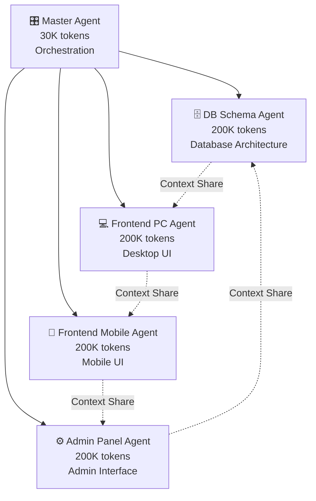

# 🎯 CodeB Multi-Agent Architecture

## 📋 System Overview

CodeB는 Claude Code의 컨텍스트 제한을 극복하기 위한 **다중 에이전트 오케스트레이션 시스템**입니다.



## 🏗️ Architecture Components

### 1. Master Agent (Orchestrator)
**Token Budget**: 30K (경량 조정자)
**Role**: 전체 시스템 오케스트레이션 및 작업 분배

```yaml
responsibilities:
  - Task decomposition and routing
  - Inter-agent communication
  - Context management
  - Progress tracking
  - Final integration
```

### 2. Specialized Sub-Agents

#### DB Schema Agent
**Token Budget**: 200K
**Focus**: Database design, schema evolution, data modeling
```yaml
expertise:
  - PostgreSQL optimization
  - Schema migrations
  - Index strategies
  - Query optimization
  - Data consistency
```

#### Frontend PC Agent  
**Token Budget**: 200K
**Focus**: Desktop web application development
```yaml
expertise:
  - React/Next.js
  - Responsive design
  - Performance optimization
  - Accessibility
  - Cross-browser compatibility
```

#### Frontend Mobile Agent
**Token Budget**: 200K
**Focus**: Mobile-optimized interfaces
```yaml
expertise:
  - Mobile-first design
  - Touch interactions
  - Progressive Web Apps
  - React Native
  - Performance on mobile networks
```

#### Admin Panel Agent
**Token Budget**: 200K
**Focus**: Administrative interfaces and dashboards
```yaml
expertise:
  - Dashboard design
  - Data visualization
  - User management
  - System monitoring
  - Analytics interfaces
```

## 🔄 Communication Protocol

### PRD-DB Ping-Pong Pattern
```yaml
phase_1_analysis:
  master: "Analyze requirements"
  agents: "Domain-specific analysis"
  output: "Structured requirements"

phase_2_design:
  master: "Coordinate design"
  agents: "Create specifications"
  output: "Technical designs"

phase_3_implementation:
  master: "Distribute tasks"
  agents: "Implement features"
  output: "Code artifacts"

phase_4_integration:
  master: "Integrate components"
  agents: "Validate interfaces"
  output: "Unified system"
```

## 🚀 Implementation Strategy

### Phase 1: Infrastructure Setup
- [ ] Create agent directory structure
- [ ] Implement context management system
- [ ] Build inter-agent communication layer
- [ ] Setup task delegation framework

### Phase 2: Agent Development
- [ ] Master Agent orchestration logic
- [ ] DB Schema Agent implementation
- [ ] Frontend PC Agent implementation
- [ ] Frontend Mobile Agent implementation
- [ ] Admin Panel Agent implementation

### Phase 3: Integration
- [ ] Context sharing mechanisms
- [ ] Task result aggregation
- [ ] Error handling and recovery
- [ ] Performance optimization

### Phase 4: Testing
- [ ] Unit tests for each agent
- [ ] Integration tests for communication
- [ ] E2E tests for complete workflows
- [ ] Performance benchmarks

## 📁 Directory Structure

```
codeb-server/
├── agents/
│   ├── master/
│   │   ├── orchestrator.js
│   │   ├── task-router.js
│   │   └── context-manager.js
│   ├── db-schema/
│   │   ├── agent.js
│   │   ├── schema-analyzer.js
│   │   └── migration-planner.js
│   ├── frontend-pc/
│   │   ├── agent.js
│   │   ├── component-builder.js
│   │   └── ui-optimizer.js
│   ├── frontend-mobile/
│   │   ├── agent.js
│   │   ├── mobile-optimizer.js
│   │   └── responsive-handler.js
│   └── admin-panel/
│       ├── agent.js
│       ├── dashboard-builder.js
│       └── analytics-engine.js
├── shared/
│   ├── communication/
│   │   ├── message-bus.js
│   │   └── context-sync.js
│   ├── context/
│   │   ├── context-store.js
│   │   └── token-manager.js
│   └── utils/
│       ├── task-splitter.js
│       └── result-aggregator.js
├── simulation/
│   ├── prd-db-simulator.js
│   └── test-scenarios/
└── tests/
    ├── unit/
    ├── integration/
    └── e2e/
```

## 🔧 Technical Implementation

### Context Management
```javascript
class ContextManager {
  constructor() {
    this.contexts = {
      master: { limit: 30000, used: 0 },
      dbSchema: { limit: 200000, used: 0 },
      frontendPC: { limit: 200000, used: 0 },
      frontendMobile: { limit: 200000, used: 0 },
      adminPanel: { limit: 200000, used: 0 }
    };
  }
  
  allocate(agent, tokens) {
    // Smart token allocation
  }
  
  overflow(fromAgent, toAgent, context) {
    // Handle context overflow
  }
}
```

### Task Delegation
```javascript
class TaskRouter {
  route(task) {
    const analysis = this.analyzeTask(task);
    const targetAgent = this.selectAgent(analysis);
    return this.delegate(targetAgent, task);
  }
  
  selectAgent(analysis) {
    // Domain-based agent selection
    if (analysis.domain === 'database') return 'dbSchema';
    if (analysis.domain === 'ui' && analysis.platform === 'desktop') return 'frontendPC';
    if (analysis.domain === 'ui' && analysis.platform === 'mobile') return 'frontendMobile';
    if (analysis.domain === 'admin') return 'adminPanel';
    return 'master';
  }
}
```

## 🎯 Success Metrics

### Performance Targets
- **Context Utilization**: >80% efficiency per agent
- **Task Completion**: <5 min for simple, <30 min for complex
- **Error Rate**: <5% task failures
- **Integration Success**: >95% component compatibility

### Quality Metrics
- **Code Coverage**: >80% test coverage
- **Documentation**: 100% API documentation
- **Security Score**: A+ rating
- **Performance**: <3s load time

## 🚦 Next Steps

1. **Immediate**: Setup agent infrastructure
2. **Week 1**: Implement Master Agent
3. **Week 2**: Develop specialized agents
4. **Week 3**: Integration and testing
5. **Week 4**: Optimization and deployment

---

**Note**: This architecture replaces the previous server-based approach and aligns with the PRD requirements for distributed context management through multiple specialized agents.