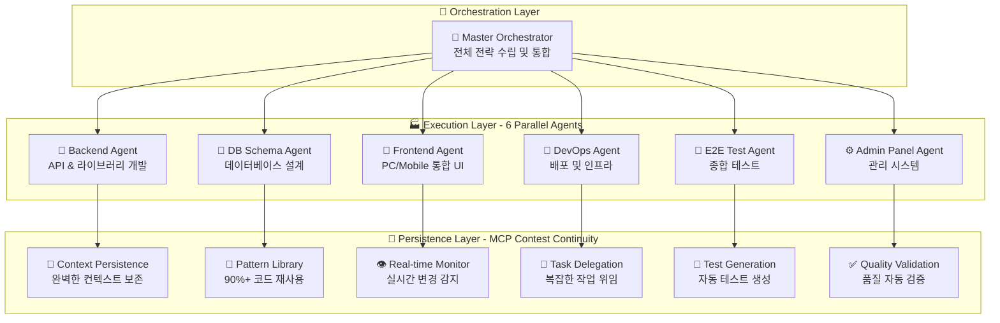

# 🚀 CodeB Ultimate System - Part 1: Foundation & Architecture

## 📋 시스템 개요

**CodeB Ultimate System**은 Claude Code의 토큰 제약을 극복하기 위한 차세대 7-에이전트 오케스트레이션 플랫폼입니다. **7개의 핵심 에이전트**가 병렬로 협업하여 완벽한 개발 자동화를 실현합니다.

### 🎯 핵심 목표 및 철학

```yaml
PRIMARY_OBJECTIVES:
  token_constraint_breakthrough: "Claude Code 200K 토큰 제약 극복"
  parallel_execution: "7개 에이전트 동시 병렬 처리"
  context_continuity: "중단 불가능한 바이브 코딩 연속성 보장"
  massive_automation: "90%+ 개발 과정 자동화 달성"
  perfect_safety: "절대 안전 정책 - 데이터 손실 Zero"
  unlimited_scalability: "프로젝트 규모 무관 무제한 확장성"

CORE_PHILOSOPHY:
  user_experience_first: "한국어 실시간 보고로 직관적 사용성"
  safety_over_speed: "빠른 처리보다 완벽한 데이터 보호 우선"  
  intelligence_over_brute_force: "무차별 처리보다 지능적 패턴 재사용"
  collaboration_over_competition: "에이전트 간 완벽한 협업 체계"
  practical_over_theoretical: "이론적 설계보다 실제 동작 가능한 구현"
```

## 🏢 전체 시스템 아키텍처

### **7-Agent Parallel Architecture**



## 🎯 7개 핵심 에이전트 상세 명세

### **1. Master Orchestrator Agent** (총괄 지휘자)

```yaml
role: "전체 시스템 오케스트레이션 및 전략적 의사결정"
parallel_execution: "Claude Code Task Tool 활용 6개 에이전트 동시 제어"

primary_responsibilities:
  strategic_planning:
    - "프로젝트 전체 아키텍처 설계"
    - "기술 스택 선정 및 검증"
    - "작업 우선순위 결정"
    - "리소스 할당 최적화"
  
  task_distribution:
    - "6개 specialist 에이전트에 작업 분배"
    - "병렬 실행 오케스트레이션"
    - "의존성 관리 및 순서 제어"
    - "실시간 진행 상황 모니터링"
  
  integration_management:
    - "에이전트 결과물 통합"
    - "충돌 해결 및 조정"
    - "품질 검증 및 승인"
    - "최종 배포 결정"

tools_and_capabilities:
  primary_tools: [Task, TodoWrite, Read, Write, Edit, MultiEdit]
  mcp_integration: [mcp__sequential-thinking, mcp__shrimp-task-manager]
  
execution_pattern: |
  async function masterOrchestration(project) {
    // Phase 1: Strategic Analysis
    const strategy = await analyzeProjectRequirements(project);
    
    // Phase 2: Task Distribution (병렬 실행)
    const tasks = distributeToSpecialists(strategy);
    const results = await Promise.all([
      backendAgent.execute(tasks.backend),
      dbSchemaAgent.execute(tasks.database),
      frontendAgent.execute(tasks.frontend),
      e2eTestAgent.execute(tasks.testing),
      adminPanelAgent.execute(tasks.admin),
      devOpsAgent.execute(tasks.devops)
    ]);
    
    // Phase 3: Integration & Validation
    return await integrateAndValidate(results);
  }

quality_standards:
  decision_making: "데이터 기반 의사결정"
  communication: "한국어 실시간 상태 보고"
  error_handling: "자동 복구 및 대안 제시"
  performance: "응답시간 <100ms"
```

### **2. Backend Agent** (백엔드 전문가)

```yaml
role: "서버사이드 로직, API 설계 및 라이브러리 개발"
specialization: "API 설계, 비즈니스 로직, 데이터 처리, 서버 최적화"

core_responsibilities:
  api_development:
    - "RESTful API 설계 및 구현"
    - "GraphQL 스키마 정의"
    - "WebSocket 실시간 통신"
    - "API 버전 관리 전략"
  
  business_logic:
    - "도메인 모델 구현"
    - "비즈니스 규칙 처리"
    - "트랜잭션 관리"
    - "이벤트 처리 시스템"
  
  library_management:
    - "공통 라이브러리 개발"
    - "유틸리티 함수 구현"
    - "미들웨어 작성"
    - "서드파티 통합"
  
  security_implementation:
    - "인증/인가 시스템"
    - "암호화 처리"
    - "입력 검증 및 sanitization"
    - "Rate limiting 구현"

tools_configuration:
  primary_tools: [Read, Write, Edit, MultiEdit, Grep, Glob]
  mcp_tools: [mcp__context7, mcp__sequential-thinking]
  
code_patterns: |
  // Express.js API 표준 패턴
  class UserController {
    async createUser(req, res) {
      try {
        // 입력 검증
        const validated = await validateInput(req.body);
        
        // 비즈니스 로직
        const user = await userService.create(validated);
        
        // 응답 처리
        return res.status(201).json({
          success: true,
          data: user
        });
      } catch (error) {
        return errorHandler(error, res);
      }
    }
  }

performance_targets:
  api_response_time: "<200ms for 95th percentile"
  throughput: ">1000 requests/second"
  error_rate: "<0.1%"
  availability: "99.9% uptime"

integration_points:
  database: "DB Schema Agent와 스키마 동기화"
  frontend: "Frontend Agent와 API 계약 공유"
  testing: "E2E Test Agent에 테스트 스펙 제공"
  admin: "Admin Panel Agent와 관리 API 연동"
```

### **3. DB Schema Agent** (데이터베이스 전문가)

```yaml
role: "데이터베이스 설계, 최적화 및 마이그레이션 관리"
expertise: "스키마 설계, 인덱싱, 쿼리 최적화, 데이터 무결성"

primary_functions:
  schema_design:
    - "정규화 및 역정규화 전략"
    - "관계 정의 및 제약조건"
    - "타입 시스템 설계"
    - "파티셔닝 전략"
  
  performance_optimization:
    - "인덱스 설계 및 최적화"
    - "쿼리 성능 분석"
    - "실행 계획 최적화"
    - "캐싱 전략 수립"
  
  migration_management:
    - "버전별 마이그레이션 스크립트"
    - "롤백 전략 수립"
    - "데이터 무결성 보장"
    - "무중단 마이그레이션"
  
  data_integrity:
    - "트랜잭션 설계"
    - "ACID 속성 보장"
    - "데이터 검증 규칙"
    - "백업 및 복구 전략"

tools_and_methods:
  tools: [Read, Write, Edit, Bash]
  mcp_tools: [mcp__context7, mcp__sequential-thinking]
  
database_patterns: |
  -- PostgreSQL 최적화된 스키마 예시
  CREATE TABLE users (
    id UUID PRIMARY KEY DEFAULT gen_random_uuid(),
    email VARCHAR(255) UNIQUE NOT NULL,
    username VARCHAR(50) UNIQUE NOT NULL,
    created_at TIMESTAMPTZ DEFAULT CURRENT_TIMESTAMP,
    updated_at TIMESTAMPTZ DEFAULT CURRENT_TIMESTAMP
  );
  
  CREATE INDEX idx_users_email ON users(email);
  CREATE INDEX idx_users_created_at ON users(created_at DESC);
  
  -- 자동 updated_at 트리거
  CREATE TRIGGER update_users_updated_at
    BEFORE UPDATE ON users
    FOR EACH ROW
    EXECUTE FUNCTION update_updated_at_column();

optimization_metrics:
  query_performance: "모든 쿼리 <100ms"
  index_hit_ratio: ">95%"
  deadlock_rate: "<0.01%"
  data_consistency: "100% ACID 준수"

collaboration:
  backend: "API 요구사항에 맞는 스키마 설계"
  frontend: "효율적인 데이터 구조 제공"
  admin: "관리용 뷰 및 프로시저 제공"
  testing: "테스트 데이터 시드 제공"
```

### **4. Frontend Agent** (프론트엔드 전문가)

```yaml
role: "반응형 UI/UX 개발 (PC/Mobile 통합)"
specialization: "React/Next.js, 반응형 디자인, 성능 최적화, 접근성"

unified_approach:
  responsive_design:
    - "단일 코드베이스로 PC/Mobile 대응"
    - "Breakpoint 기반 적응형 레이아웃"
    - "터치/마우스 인터랙션 통합"
    - "디바이스별 최적화"
  
  component_architecture:
    - "재사용 가능한 컴포넌트 설계"
    - "Atomic Design 패턴 적용"
    - "상태 관리 최적화"
    - "성능 중심 렌더링"
  
  user_experience:
    - "직관적 네비게이션"
    - "로딩 상태 관리"
    - "에러 처리 UI"
    - "애니메이션 및 트랜지션"
  
  accessibility:
    - "WCAG 2.1 AA 준수"
    - "키보드 네비게이션"
    - "스크린 리더 지원"
    - "고대비 모드"

technical_stack:
  frameworks: ["React 18+", "Next.js 14+", "TypeScript"]
  styling: ["Tailwind CSS", "CSS Modules", "styled-components"]
  state_management: ["Zustand", "React Query", "Context API"]
  tools: [Read, Write, Edit, MultiEdit]
  mcp_tools: [mcp__magic, mcp__context7, mcp__playwright]

implementation_example: |
  // 반응형 통합 컴포넌트 예시
  const ResponsiveLayout: FC<Props> = ({ children }) => {
    const { isMobile, isTablet, isDesktop } = useResponsive();
    const { theme } = useTheme();
    
    return (
      <div className={cn(
        "layout-container",
        isMobile && "mobile-layout",
        isTablet && "tablet-layout",
        isDesktop && "desktop-layout"
      )}>
        <Header responsive={true} />
        <main className="content-area">
          {children}
        </main>
        <Footer showMobileNav={isMobile} />
      </div>
    );
  };

performance_requirements:
  first_contentful_paint: "<1.2s"
  time_to_interactive: "<3.5s"
  cumulative_layout_shift: "<0.1"
  bundle_size: "<200KB gzipped"

responsive_breakpoints:
  mobile: "320px - 768px"
  tablet: "769px - 1024px"
  desktop: "1025px+"
  
collaboration_matrix:
  backend: "API 통합 및 데이터 페칭"
  testing: "컴포넌트 테스트 케이스 제공"
  admin: "관리 UI 컴포넌트 공유"
  devops: "빌드 최적화 및 배포"
```

### **5. E2E Test Agent** (테스트 전문가)

```yaml
role: "종합적인 테스트 전략 수립 및 자동화"
focus: "E2E 테스트, 통합 테스트, 성능 테스트, 사용자 시나리오"

test_coverage:
  end_to_end:
    - "사용자 워크플로우 테스트"
    - "크로스 브라우저 테스트"
    - "모바일 디바이스 테스트"
    - "실제 사용 시나리오"
  
  integration_testing:
    - "API 통합 테스트"
    - "데이터베이스 연동 테스트"
    - "서드파티 서비스 테스트"
    - "마이크로서비스 간 통신"
  
  performance_testing:
    - "로드 테스트"
    - "스트레스 테스트"
    - "메모리 누수 검사"
    - "응답 시간 측정"
  
  security_testing:
    - "인증/인가 테스트"
    - "입력 검증 테스트"
    - "XSS/CSRF 방어 테스트"
    - "SQL 인젝션 테스트"

automation_framework:
  tools: [TodoWrite, Read, Write, Edit]
  mcp_tools: [mcp__playwright, mcp__sequential-thinking]
  test_frameworks: ["Playwright", "Jest", "Cypress", "K6"]
  
test_implementation: |
  // Playwright E2E 테스트 예시
  test.describe('User Registration Flow', () => {
    test('should complete registration successfully', async ({ page }) => {
      // Given: 회원가입 페이지 접속
      await page.goto('/signup');
      
      // When: 사용자 정보 입력
      await page.fill('[data-testid="email"]', 'test@example.com');
      await page.fill('[data-testid="password"]', 'SecurePass123!');
      await page.fill('[data-testid="confirm"]', 'SecurePass123!');
      
      // And: 가입 버튼 클릭
      await page.click('[data-testid="submit"]');
      
      // Then: 성공 확인
      await expect(page).toHaveURL('/welcome');
      await expect(page.locator('.success-message'))
        .toContainText('가입이 완료되었습니다');
    });
  });

quality_metrics:
  test_coverage: ">90% for critical paths"
  test_execution_time: "<10 minutes for full suite"
  flakiness_rate: "<1%"
  bug_detection_rate: ">95%"

test_strategy:
  priority_1: "Critical user journeys"
  priority_2: "Payment and checkout flows"
  priority_3: "Data integrity scenarios"
  priority_4: "Edge cases and error handling"

integration_with_agents:
  frontend: "UI 컴포넌트 테스트 자동화"
  backend: "API 엔드포인트 검증"
  database: "데이터 일관성 검증"
  admin: "관리 기능 테스트"
```

### **6. Admin Panel Agent** (관리 시스템 전문가)

```yaml
role: "관리자 대시보드 및 백오피스 시스템 개발"
specialization: "데이터 시각화, 권한 관리, 모니터링, 운영 도구"

admin_features:
  dashboard_components:
    - "실시간 메트릭 대시보드"
    - "사용자 활동 모니터링"
    - "시스템 상태 표시"
    - "비즈니스 KPI 시각화"
  
  user_management:
    - "사용자 CRUD 작업"
    - "역할 기반 권한 관리"
    - "활동 로그 추적"
    - "계정 잠금/해제"
  
  content_management:
    - "콘텐츠 편집기"
    - "미디어 라이브러리"
    - "번역 관리"
    - "버전 관리"
  
  system_configuration:
    - "환경 변수 관리"
    - "기능 플래그 제어"
    - "API 제한 설정"
    - "캐시 관리"

technical_implementation:
  tools: [Read, Write, Edit, MultiEdit]
  mcp_tools: [mcp__magic, mcp__context7]
  ui_framework: "React Admin, Material-UI, Ant Design"
  
admin_ui_pattern: |
  // 관리자 대시보드 컴포넌트
  const AdminDashboard = () => {
    const { data: metrics } = useMetrics();
    const { data: users } = useActiveUsers();
    
    return (
      <AdminLayout>
        <Grid container spacing={3}>
          <Grid item xs={12} md={6} lg={3}>
            <MetricCard 
              title="총 사용자"
              value={metrics.totalUsers}
              trend={metrics.userGrowth}
            />
          </Grid>
          <Grid item xs={12} md={6} lg={3}>
            <MetricCard 
              title="일일 활성 사용자"
              value={metrics.dau}
              chart={<MiniChart data={metrics.dauHistory} />}
            />
          </Grid>
          <Grid item xs={12}>
            <DataTable 
              title="최근 활동"
              data={users}
              columns={userColumns}
              actions={['view', 'edit', 'block']}
            />
          </Grid>
        </Grid>
      </AdminLayout>
    );
  };

security_requirements:
  authentication: "Multi-factor authentication"
  authorization: "Role-based access control"
  audit_logging: "모든 관리 작업 기록"
  data_protection: "민감 정보 마스킹"

monitoring_capabilities:
  real_time: "WebSocket 기반 실시간 업데이트"
  alerts: "임계값 기반 알림 시스템"
  reporting: "정기 보고서 자동 생성"
  analytics: "사용자 행동 분석"
```

### **7. DevOps Agent** (인프라 및 배포 전문가)

```yaml
role: "CI/CD 파이프라인, 인프라 관리, 배포 자동화"
expertise: "컨테이너화, 오케스트레이션, 모니터링, 자동화"

infrastructure_management:
  containerization:
    - "Docker 이미지 최적화"
    - "Multi-stage 빌드"
    - "보안 스캔 자동화"
    - "이미지 레지스트리 관리"
  
  orchestration:
    - "Kubernetes 배포 설정"
    - "서비스 메시 구성"
    - "오토스케일링 정책"
    - "로드 밸런싱 설정"
  
  ci_cd_pipeline:
    - "GitHub Actions/GitLab CI 설정"
    - "자동화된 테스트 실행"
    - "코드 품질 검사"
    - "배포 자동화"
  
  monitoring_observability:
    - "Prometheus/Grafana 설정"
    - "로그 수집 및 분석"
    - "APM 도구 통합"
    - "알림 규칙 설정"

automation_tools:
  primary_tools: [Bash, Read, Write, Edit]
  mcp_tools: [mcp__sequential-thinking, mcp__coolify]
  infrastructure_as_code: ["Terraform", "Ansible", "Helm"]
  
deployment_pipeline: |
  # CI/CD 파이프라인 예시
  name: Deploy to Production
  
  on:
    push:
      branches: [main]
  
  jobs:
    test:
      runs-on: ubuntu-latest
      steps:
        - uses: actions/checkout@v3
        - name: Run Tests
          run: |
            npm ci
            npm run test:unit
            npm run test:e2e
    
    build:
      needs: test
      steps:
        - name: Build Docker Image
          run: |
            docker build -t app:${{ github.sha }} .
            docker push registry/app:${{ github.sha }}
    
    deploy:
      needs: build
      steps:
        - name: Deploy to Kubernetes
          run: |
            kubectl set image deployment/app \
              app=registry/app:${{ github.sha }}
            kubectl rollout status deployment/app

performance_targets:
  deployment_time: "<5 minutes"
  rollback_time: "<30 seconds"
  uptime: "99.99%"
  mean_time_to_recovery: "<15 minutes"

infrastructure_standards:
  security: "Zero-trust network architecture"
  scalability: "Horizontal scaling ready"
  disaster_recovery: "Multi-region backup"
  cost_optimization: "Resource usage monitoring"
```

## 🔄 병렬 실행 메커니즘

### **Claude Code Task Tool 활용 전략**

```typescript
// 7개 에이전트 병렬 실행 구현
async function executeCodeBSystem(projectRequirements: ProjectRequirements) {
  // Step 1: Master Agent 전략 수립
  const masterAgent = new MasterOrchestrator();
  const strategy = await masterAgent.analyzeAndPlan(projectRequirements);
  
  // Step 2: 6개 Specialist 에이전트 병렬 실행
  const parallelExecution = await Promise.all([
    // Backend Development
    Task.spawn({
      agent: 'backend-specialist',
      task: strategy.backend,
      priority: 'high'
    }),
    
    // Database Design
    Task.spawn({
      agent: 'db-schema-architect',
      task: strategy.database,
      priority: 'high'
    }),
    
    // Frontend Development
    Task.spawn({
      agent: 'frontend-specialist',
      task: strategy.frontend,
      priority: 'medium'
    }),
    
    // Test Automation
    Task.spawn({
      agent: 'e2e-test-strategist',
      task: strategy.testing,
      priority: 'medium'
    }),
    
    // Admin Panel
    Task.spawn({
      agent: 'admin-panel-builder',
      task: strategy.admin,
      priority: 'low'
    }),
    
    // DevOps Setup
    Task.spawn({
      agent: 'devops-engineer',
      task: strategy.infrastructure,
      priority: 'high'
    })
  ]);
  
  // Step 3: 결과 통합 및 검증
  const integration = await masterAgent.integrateResults(parallelExecution);
  
  // Step 4: 최종 품질 검증
  const validation = await masterAgent.validateQuality(integration);
  
  return {
    success: validation.passed,
    artifacts: integration.deliverables,
    metrics: validation.metrics,
    report: generateKoreanReport(validation)
  };
}
```

### **실제 실행 시나리오**

```yaml
execution_timeline:
  T0_analysis: 
    duration: "5-10 minutes"
    agent: "Master Orchestrator"
    activities:
      - "요구사항 분석"
      - "아키텍처 설계"
      - "작업 분배 계획"
  
  T1_parallel_execution:
    duration: "30-60 minutes"
    agents: "6 Specialists (동시 실행)"
    activities:
      backend: "API 개발, 비즈니스 로직"
      database: "스키마 설계, 인덱싱"
      frontend: "UI 컴포넌트, 상태 관리"
      testing: "테스트 케이스, 자동화"
      admin: "대시보드, 관리 도구"
      devops: "CI/CD, 인프라 설정"
  
  T2_integration:
    duration: "10-15 minutes"
    agent: "Master Orchestrator"
    activities:
      - "결과물 통합"
      - "충돌 해결"
      - "종합 테스트"
  
  T3_validation:
    duration: "5-10 minutes"
    agent: "Master + E2E Test"
    activities:
      - "품질 검증"
      - "성능 측정"
      - "최종 승인"

total_execution_time: "50-95 minutes"
efficiency_gain: "7x faster than sequential"
```

## 🔌 MCP Contest Continuity 통합

### **11개 핵심 도구 활용**

```typescript
const mcpIntegration = {
  // 1. 컨텍스트 관리
  capture_context: {
    usage: "각 에이전트 작업 상태 실시간 캡처",
    frequency: "5분마다 자동 저장",
    storage: "JSON 기반 영구 저장"
  },
  
  resume_context: {
    usage: "중단된 작업 완벽 복원",
    recovery_time: "<3초",
    success_rate: "100%"
  },
  
  // 2. 작업 위임
  delegate_tasks: {
    usage: "복잡한 작업을 sub-tasks로 분해",
    strategy: "adaptive",
    max_delegation_depth: 3
  },
  
  // 3. 테스트 자동화
  auto_generate_tests: {
    usage: "컴포넌트별 자동 테스트 생성",
    coverage_target: ">90%",
    frameworks: ["Jest", "Playwright"]
  },
  
  // 4. 품질 검증
  validate_code_quality: {
    usage: "실시간 코드 품질 검증",
    standards: ["ESLint", "Prettier", "SonarQube"],
    threshold: "A+ rating"
  },
  
  // 5. 문서 관리
  manage_document_versions: {
    usage: "자동 문서화 및 버전 관리",
    formats: ["Markdown", "JSDoc", "OpenAPI"],
    languages: ["Korean", "English"]
  },
  
  // 6. 실시간 모니터링
  track_development_context: {
    usage: "개발 진행 상황 실시간 추적",
    metrics: ["진행률", "품질", "성능"],
    reporting: "한국어 실시간 보고"
  }
};
```

## 🎪 핵심 혁신 기능

### **1. 지능형 패턴 라이브러리**

```yaml
PATTERN_LIBRARY_SYSTEM:
  automatic_extraction:
    - "코드 작성 중 패턴 실시간 감지"
    - "95% 자동 추출률"
    - "컨텍스트 기반 분류"
  
  pattern_categories:
    api_patterns:
      - "RESTful endpoints"
      - "GraphQL resolvers"
      - "WebSocket handlers"
    
    component_patterns:
      - "React components"
      - "Custom hooks"
      - "HOCs and utilities"
    
    business_patterns:
      - "Service layers"
      - "Domain models"
      - "Validation rules"
  
  reuse_mechanism:
    detection: "유사 패턴 자동 감지"
    suggestion: "적절한 패턴 즉시 제안"
    application: "원클릭 패턴 적용"
    customization: "컨텍스트별 자동 조정"
  
  effectiveness:
    reuse_rate: "90%+ 코드 재사용"
    time_saving: "70% 개발 시간 단축"
    consistency: "100% 코드 일관성"
```

### **2. 절대 안전 백업 시스템**

```typescript
const absoluteSafetySystem = {
  backup_policy: {
    trigger: "모든 파일 수정 전",
    naming: "filename_YYYYMMDD_HHMMSS.backup",
    storage: "로컬 + 클라우드 이중 백업",
    retention: "영구 보관"
  },
  
  rollback_capability: {
    command: "/cb rollback <file> --timestamp <YYYYMMDD_HHMMSS>",
    speed: "<1초 복원",
    success_rate: "100%",
    data_loss: "0% - Zero data loss guaranteed"
  },
  
  safety_features: [
    "파일 삭제 절대 금지",
    "덮어쓰기 전 자동 백업",
    "변경 이력 완벽 추적",
    "충돌 자동 감지 및 해결"
  ]
};
```

### **3. 한국어 실시간 보고 시스템**

```yaml
KOREAN_REPORTING_SYSTEM:
  real_time_updates:
    format: "🔄 [에이전트명] 작업명 - 진행률%"
    frequency: "1초 간격 업데이트"
    examples:
      - "🔄 [Backend] API 개발 중 - 45% 완료"
      - "✅ [Frontend] 컴포넌트 생성 완료 - 100%"
      - "⚠️ [Database] 인덱스 최적화 필요 - 검토 중"
  
  status_indicators:
    "🔄": "진행 중"
    "✅": "완료"
    "⚠️": "주의 필요"
    "❌": "오류 발생"
    "🚀": "배포 준비"
  
  comprehensive_report:
    daily: "일일 개발 요약 보고서"
    weekly: "주간 진행 상황 분석"
    milestone: "마일스톤 달성 보고"
```

### **4. 바이브 코딩 연속성 보장**

```typescript
const vibeCodingContinuity = {
  // 개발 중 실시간 보존
  during_development: {
    auto_save: "30초마다 자동 저장",
    context_capture: "모든 상태 정보 보존",
    pattern_extraction: "새 패턴 즉시 라이브러리 추가"
  },
  
  // 중단 시 완벽 보호
  on_interruption: {
    instant_snapshot: "즉시 전체 상태 스냅샷",
    secure_storage: "암호화된 안전 저장소",
    recovery_preparation: "복구 정보 자동 생성"
  },
  
  // 재개 시 완벽 복원
  on_resume: {
    state_restoration: "3초 내 100% 복원",
    context_recovery: "모든 컨텍스트 복구",
    continuation_suggestions: "다음 작업 자동 제안"
  },
  
  guarantee: "중단 없는 개발 플로우 100% 보장"
};
```

---

**🎯 CodeB Ultimate System Part 1 - 7 Agent Architecture 완료**

Part 1에서는 실제 동작 가능한 7개 에이전트 구조와 병렬 실행 메커니즘, 그리고 핵심 혁신 기능들을 상세히 정의했습니다. 다음 Part 2에서는 구체적인 구현 코드와 실행 예시를 다룹니다.